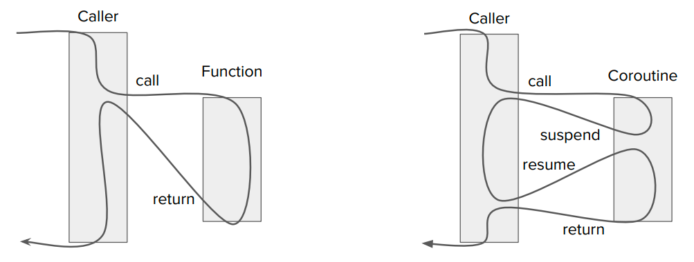

# 定义

```
Coroutines are computer program components that allow execution to be suspended and resumed, generalizing subroutines for cooperative multitasking. 
Coroutines are well-suited for implementing familiar program components such as cooperative tasks, exceptions, event loops, iterators, infinite lists and pipes.

They have been described as "functions whose execution you can pause".

Melvin Conway coined the term coroutine in 1958 when he applied it to the construction of an assembly program. The first published explanation of the coroutine appeared later, in 1963.
```

左边是函数调用的流程， 右边是协程调用流


根据上图，可以看出来协程的特点是可中断可恢复。
我们可以把它当成一个特殊的函数。

# 示例

我们来看一个简单的协程（无栈协程）代码示例：
```c++
#include <iostream>
#include <coroutine>

struct Task {
    class promise_type{
    public:
        Task get_return_object() {
            return Task{ std::coroutine_handle<promise_type>::from_promise(*this)};
        }
        std::suspend_never initial_suspend() { return {}; }
        std::suspend_never final_suspend() noexcept { return {}; }
        void unhandled_exception() {}
        //void return_void() {}
    };
public:
    Task(std::coroutine_handle<promise_type> handle) : coroutine_handle_(handle) {}

    void resume() {
        coroutine_handle_.resume();
    }

private:
    std::coroutine_handle<promise_type> coroutine_handle_;
};

Task hello_coroutine(int n) {
    std::cout << "hello ";
    co_await std::suspend_always{};
    std::cout << " coroutine " << std::hex << n << '\n';
}

int main() {

    int n{0x3f};
    auto task = hello_coroutine(n);
    std::cout << "---------";
    task.resume();
    return 0;
}
```

程序的运行结果是：

```
hello --------- coroutine 3f
```

我们发现，打印完hello之后，程序没有继续打印后面的字符串，而是回到了main函数（协程调用方）中，在执行task.resume()之后又回到协程函数中继续执行，到此为止，我们可能会产生这些疑惑？

- 1.为什么hello_coroutine没有顺序执行？
- 2.如何跳转回调用方的？
- 3.Task中的promise_type是什么？为什么要定义那些函数？
- 4.co_await 关键字是什么？
- ...

我们带着这些问题继续学习协程。
协程在实现上主要分成两种：有栈协程和无栈协程。
所谓的有栈协程就是指运行环境的恢复是通过函数栈的恢复实现的，而无栈协程是通过编译器对代码进行扩展实现的，思想和状态机类似。

# 有栈协程

我们知道，一般的函数调用是依赖栈的，在调用函数时会创建一个栈帧，在函数执行完成后回收栈帧。
而有栈协程就是在协程函数执行时申请一块内存，用户自行保存上下文/切换上下文就可以实现协程的切换。

我们简单回顾一下调用一个函数时，底层做了什么事情。

```c++
int func() {
    return 100;
}

int main()
{
    func();
    return 0;
}
```

x86-64 gcc 13.2 (-m32) 得到的汇编指令如下：

```
func():
        pushl   %ebp
        movl    %esp, %ebp
        movl    $100, %eax
        popl    %ebp
        ret
main:
        pushl   %ebp
        movl    %esp, %ebp
        call    func()
        movl    $0, %eax
        popl    %ebp
        ret
```


根据cdecl调用约定：https://en.wikipedia.org/wiki/X86_calling_conventions#Caller-saved_(volatile)_registers

以 x86 平台为例:

1. %ebx-通用寄存器（callee-saved）
2. %edi-通用寄存器（callee-saved）
3. %esi-通用寄存器（callee-saved）
4. %ebp-栈帧基地址指针
5. %esp-栈顶指针
6. ret address- 返回地址（即“下一条要执行的指令”）

这些寄存器的组合能让协程在切回来时：

- 找到栈位置（%esp）

- 恢复原函数返回的位置（ret address）

- 恢复原来的局部变量访问基址（%ebp）

- 恢复部分通用寄存器状态（如 %ebx, %esi, %edi）

其他寄存器如 %eax, %ecx, %edx 被认为是 caller-saved，不需要 callee 保存，调用者自己负责备份。
我们可以通过申请一段内存存放函数运行时的上下文，在恢复的时候将内存中的上下文复制到寄存器中，就可以模拟协程，

stackful_co.c
```c
#include <stdio.h>
#include <stdlib.h>
#include <string.h>

const int CO_SIZE = 1024;

static char** s_main_co = NULL;
static char** s_func_co = NULL;

extern void swap_context(char **cur_co, char** next_co);

char** init_context(char* func) {
  char** ctx = (char**) malloc(sizeof(char*) * CO_SIZE);
  memset(ctx, 0, sizeof(char*) * CO_SIZE);  //用来存放上下文

  *(ctx + CO_SIZE - 1) = (char*)func;   //这里为了方便，第一次调用时，将函数入口地址作为return address
  *(ctx + CO_SIZE - 6) = (char*)(ctx + CO_SIZE - 7);  //预留6个寄存器，其余作为栈帧
  return ctx + CO_SIZE;   //栈地址增长方向与堆地址增长方向不同
}

void func() {
  char* str = "hi, func.";
  printf("%s, before yield\n", __FUNCTION__);
  swap_context(s_func_co, s_main_co);
  printf("%s, func resume, %s\n",__FUNCTION__,  str);
  swap_context(s_func_co, s_main_co);
}

int main()
{
  s_main_co = init_context((char*)main);
  s_func_co = init_context((char*)func);

  char* str = "hi, main.";
  printf("%s, before call func\n", __FUNCTION__);
  swap_context(s_main_co, s_func_co);
  printf( "%s, main resume, %s\n", __FUNCTION__,  str);
  swap_context(s_main_co, s_func_co);


  free(s_main_co - CO_SIZE);
  free(s_func_co - CO_SIZE);
  return 0;
}
```

swap_context.s

```c
  .globl swap_context
  .type swap_context, @function

swap_context:
    //不会建立栈帧
    movl 4(%esp), %eax    //获取第一个参数cur_co, 存放在eax中
    movl %ebx, -8(%eax)   //将各个寄存器中的值存储到cur_co中
    movl %edi, -12(%eax)
    movl %esi, -16(%eax)
    movl %ebp, -20(%eax)
    movl %esp, -24(%eax)

    //  %esp  存储的是当前调用栈的顶部所在的地址，
    // (%esp) 是顶部地址所指向的内存区域存储的值，即返回cur_co的返回地址
    movl (%esp), %ecx
    movl %ecx, -4(%eax)

    // 获取 swap_ctx 的第二个参数 char **next_co
    movl 8(%esp), %eax

    // 依次将 next 存储的值写入各个寄存器，
    movl  -8(%eax), %ebx
    movl -12(%eax), %edi
    movl -16(%eax), %esi
    movl -20(%eax), %ebp
    movl -24(%eax), %esp

    movl -4(%eax), %ecx  //前面约定了这个地址存放的是返回地址，所以我们将它赋值给esp指向的内容
    movl %ecx, (%esp)

    ret
```

```
gcc -m32 stackful_co.c swap_context.s -o test
```

有栈协程缺点比较明显：

- 如果申请的内存太大，可能会浪费内存，同时也限制了协程的数量。

- 如果申请的内存太小，可能会溢出的风险。

- 同时高频的有栈协程切换会破环CPU的栈缓冲区预测的优化，性能上限不如无栈协程。

# 无栈协程
相较于有栈协程这种朴素的实现方式，c++20的协程是无栈协程，他采用的是状态机的思想，通过编译器生成代码实现协程上下文之间的切换。

创建协程的流程：

- 创建一个协程帧-coroutine frame
- 在协程帧里面构建promise对象
- 把协程的参数拷贝到协程帧里
- 调用promise.get_return_object() 返回一个对象

promise_type中的定制点：

- initial_suspend: 在协程创建后调用， 可以控制是否挂起
- final_suspend: 在协程执行结束后调用，这里也可以控制是否挂起
- return_value: 保存协程返回值
- unhandled_exception: 处理异常

```c++
#include <coroutine>
#include <iostream>
#include <thread>

namespace Coroutine {
  struct task {
    struct promise_type {
      promise_type() {
        std::cout << "1.create promie object\n";
      }
      task get_return_object() {
        std::cout << "2.create coroutine return object, and the coroutine is created now\n";
        return {std::coroutine_handle<task::promise_type>::from_promise(*this)};
      }
      std::suspend_never initial_suspend() {
        std::cout << "3.do you want to susupend the current coroutine?\n";
        std::cout << "4.don't suspend because return std::suspend_never, so continue to execute coroutine body\n";
        return {};
      }
      std::suspend_never final_suspend() noexcept {
        std::cout << "13.coroutine body finished, do you want to susupend the current coroutine?\n";
        std::cout << "14.don't suspend because return std::suspend_never, and the continue will be automatically destroyed, bye\n";
        return {};
      }
      void return_void() {
        std::cout << "12.coroutine don't return value, so return_void is called\n";
      }
      void unhandled_exception() {}
    };

    std::coroutine_handle<task::promise_type> handle_;
  };

  struct awaiter {
    bool await_ready() {
      std::cout << "6.do you want to suspend current coroutine?\n";
      std::cout << "7.yes, suspend becase awaiter.await_ready() return false\n";
      return false;
    }
    void await_suspend(
      std::coroutine_handle<task::promise_type> handle) {
      std::cout << "8.execute awaiter.await_suspend()\n";
      std::thread([handle]() mutable { handle(); }).detach();
      std::cout << "9.a new thread lauched, and will return back to caller\n";
    }
    void await_resume() {}
  };

  task test() {
    std::cout << "5.begin to execute coroutine body, the thread id=" << std::this_thread::get_id() << "\n";//#1
    co_await awaiter{};
    std::cout << "11.coroutine resumed, continue execcute coroutine body now, the thread id=" << std::this_thread::get_id() << "\n";//#3
  }
}// namespace Coroutine

int main() {
  Coroutine::test();
  std::cout << "10.come back to caller becuase of co_await awaiter\n";
  std::this_thread::sleep_for(std::chrono::seconds(1));

  return 0;
}
```

```
IntReader::await_ready():
        pushq   %rbp
        movq    %rsp, %rbp
        movq    %rdi, -8(%rbp)
        movl    $0, %eax
        popq    %rbp
        ret
IntReader::await_suspend(std::__n4861::coroutine_handle<void>)::'lambda'()::operator()() const:
        pushq   %rbp
        movq    %rsp, %rbp
        subq    $16, %rsp
        movq    %rdi, -8(%rbp)
        movl    $3, %edi
        call    sleep
        movq    -8(%rbp), %rax
        movq    (%rax), %rax
        movl    $101, (%rax)
        movq    -8(%rbp), %rax
        addq    $8, %rax
        movq    %rax, %rdi
        call    std::__n4861::coroutine_handle<void>::resume() const
        nop
        leave
        ret
IntReader::await_suspend(std::__n4861::coroutine_handle<void>):
        pushq   %rbp
        movq    %rsp, %rbp
        pushq   %rbx
        subq    $56, %rsp
        movq    %rdi, -56(%rbp)
        movq    %rsi, -64(%rbp)
        movq    -56(%rbp), %rax
        movq    %rax, -32(%rbp)
        movq    -64(%rbp), %rax
        movq    %rax, -24(%rbp)
        leaq    -32(%rbp), %rdx
        leaq    -40(%rbp), %rax
        movq    %rdx, %rsi
        movq    %rax, %rdi
        call    std::thread::thread<IntReader::await_suspend(std::__n4861::coroutine_handle<void>)::'lambda'(), void>(IntReader::await_suspend(std::__n4861::coroutine_handle<void>)::'lambda'()&&)
        leaq    -40(%rbp), %rax
        movq    %rax, %rdi
        call    std::thread::detach()
        leaq    -40(%rbp), %rax
        movq    %rax, %rdi
        call    std::thread::~thread() [complete object destructor]
        jmp     .L26
        movq    %rax, %rbx
        leaq    -40(%rbp), %rax
        movq    %rax, %rdi
        call    std::thread::~thread() [complete object destructor]
        movq    %rbx, %rax
        movq    %rax, %rdi
        call    _Unwind_Resume
.L26:
        movq    -8(%rbp), %rbx
        leave
        ret
IntReader::await_resume():
        pushq   %rbp
        movq    %rsp, %rbp
        movq    %rdi, -8(%rbp)
        movq    -8(%rbp), %rax
        movl    (%rax), %eax
        popq    %rbp
        ret
Task::promise_type::get_return_object():
        pushq   %rbp
        movq    %rsp, %rbp
        movq    %rdi, -8(%rbp)
        nop
        popq    %rbp
        ret
Task::promise_type::initial_suspend():
        pushq   %rbp
        movq    %rsp, %rbp
        movq    %rdi, -8(%rbp)
        nop
        popq    %rbp
        ret
Task::promise_type::final_suspend():
        pushq   %rbp
        movq    %rsp, %rbp
        movq    %rdi, -8(%rbp)
        nop
        popq    %rbp
        ret
Task::promise_type::unhandled_exception():
        pushq   %rbp
        movq    %rsp, %rbp
        movq    %rdi, -8(%rbp)
        nop
        popq    %rbp
        ret
Task::promise_type::return_void():
        pushq   %rbp
        movq    %rsp, %rbp
        movq    %rdi, -8(%rbp)
        nop
        popq    %rbp
        ret
func():
        pushq   %rbp
        movq    %rsp, %rbp
        pushq   %rbx
        subq    $24, %rsp
        movq    $0, -24(%rbp)
        movb    $0, -25(%rbp)
        movb    $0, -26(%rbp)
        movl    $72, %eax
        movq    %rax, %rdi
        call    operator new(unsigned long)
        movq    %rax, -24(%rbp)
        movq    -24(%rbp), %rax
        movb    $1, 34(%rax)
        movq    -24(%rbp), %rax
        movq    $func(func()::_Z4funcv.Frame*) (.actor), (%rax)
        movq    -24(%rbp), %rax
        movq    $func(func()::_Z4funcv.Frame*) (.destroy), 8(%rax)
        movq    -24(%rbp), %rax
        addq    $16, %rax
        movq    %rax, %rdi
        call    Task::promise_type::get_return_object()
        movq    -24(%rbp), %rax
        movw    $0, 32(%rax)
        movq    -24(%rbp), %rax
        movq    %rax, %rdi
        call    func(func()::_Z4funcv.Frame*) (.actor)
        jmp     .L43
        movq    %rax, %rdi
        call    __cxa_begin_catch
        movq    -24(%rbp), %rax
        movq    %rax, %rdi
        call    operator delete(void*)
        call    __cxa_rethrow
        movq    %rax, %rbx
        call    __cxa_end_catch
        movq    %rbx, %rax
        movq    %rax, %rdi
        call    _Unwind_Resume
.L43:
        movq    -8(%rbp), %rbx
        leave
        ret

.LC0:
        .string "after resume from reader1, current thread id: "
.LC1:
        .string "after resume from reader2, current thread id: "
.LC2:
        .string "after resume from reader3, current thread id: "
func(func()::_Z4funcv.Frame*) (.actor):
        pushq   %rbp
        movq    %rsp, %rbp
        pushq   %rbx
        subq    $40, %rsp
        movq    %rdi, -40(%rbp)
        movq    -40(%rbp), %rax
        movzwl  32(%rax), %eax
        andl    $1, %eax
        testw   %ax, %ax
        je      .L45
        movq    -40(%rbp), %rax
        movzwl  32(%rax), %eax
        movzwl  %ax, %eax
        cmpl    $11, %eax
        ja      .L46
        movl    %eax, %eax
        movq    .L48(,%rax,8), %rax
        jmp     *%rax
.L48:
        .quad   .L46
        .quad   .L84
        .quad   .L46
        .quad   .L55
        .quad   .L46
        .quad   .L56
        .quad   .L46
        .quad   .L57
        .quad   .L46
        .quad   .L58
        .quad   .L46
        .quad   .L59
.L46:
        ud2
.L45:
        movq    -40(%rbp), %rax
        movzwl  32(%rax), %eax
        movzwl  %ax, %eax
        cmpl    $10, %eax
        ja      .L60
        movl    %eax, %eax
        movq    .L62(,%rax,8), %rax
        jmp     *%rax
.L62:
        .quad   .L67
        .quad   .L60
        .quad   .L69
        .quad   .L60
        .quad   .L70
        .quad   .L60
        .quad   .L71
        .quad   .L60
        .quad   .L72
        .quad   .L60
        .quad   .L73
.L67:
        movq    -40(%rbp), %rbx
        movq    -40(%rbp), %rax
        movq    %rax, %rdi
        call    std::__n4861::coroutine_handle<Task::promise_type>::from_address(void*)
        movq    %rax, 24(%rbx)
        movq    -40(%rbp), %rax
        movb    $0, 35(%rax)
        movq    -40(%rbp), %rax
        addq    $16, %rax
        movq    %rax, %rdi
        call    Task::promise_type::initial_suspend()
        movq    -40(%rbp), %rax
        addq    $36, %rax
        movq    %rax, %rdi
        call    std::__n4861::suspend_never::await_ready() const
        xorl    $1, %eax
        testb   %al, %al
        jne     .L68
        jmp     .L69
.L60:
        ud2
.L68:
        movq    -40(%rbp), %rax
        movw    $2, 32(%rax)
        movq    -40(%rbp), %rax
        leaq    36(%rax), %rbx
        movq    -40(%rbp), %rax
        addq    $24, %rax
        movq    %rax, %rdi
        call    std::__n4861::coroutine_handle<Task::promise_type>::operator std::__n4861::coroutine_handle<void>() const
        movq    %rax, %rsi
        movq    %rbx, %rdi
        call    std::__n4861::suspend_never::await_suspend(std::__n4861::coroutine_handle<void>) const
        jmp     .L74
.L55:
        jmp     .L54
.L69:
        movq    -40(%rbp), %rax
        movb    $1, 35(%rax)
        movq    -40(%rbp), %rax
        addq    $36, %rax
        movq    %rax, %rdi
        call    std::__n4861::suspend_never::await_resume() const
        movq    -40(%rbp), %rax
        movl    $0, 40(%rax)
        movq    -40(%rbp), %rax
        addq    $40, %rax
        movq    %rax, %rdi
        call    IntReader::await_ready()
        xorl    $1, %eax
        testb   %al, %al
        je      .L70
        movq    -40(%rbp), %rax
        movw    $4, 32(%rax)
        movq    -40(%rbp), %rax
        leaq    40(%rax), %rbx
        movq    -40(%rbp), %rax
        addq    $24, %rax
        movq    %rax, %rdi
        call    std::__n4861::coroutine_handle<Task::promise_type>::operator std::__n4861::coroutine_handle<void>() const
        movq    %rax, %rsi
        movq    %rbx, %rdi
        call    IntReader::await_suspend(std::__n4861::coroutine_handle<void>)
        jmp     .L74
.L56:
        jmp     .L54
.L70:
        movq    -40(%rbp), %rax
        addq    $40, %rax
        movq    %rax, %rdi
        call    IntReader::await_resume()
        movq    -40(%rbp), %rdx
        movl    %eax, 44(%rdx)
        movl    $.LC0, %esi
        movl    $_ZSt4cout, %edi
        call    std::basic_ostream<char, std::char_traits<char>>& std::operator<<<std::char_traits<char>>(std::basic_ostream<char, std::char_traits<char>>&, char const*)
        movq    %rax, %rbx
        call    std::this_thread::get_id()
        movq    %rax, %rsi
        movq    %rbx, %rdi
        call    std::basic_ostream<char, std::char_traits<char>>& std::operator<<<char, std::char_traits<char>>(std::basic_ostream<char, std::char_traits<char>>&, std::thread::id)
        movl    $10, %esi
        movq    %rax, %rdi
        call    std::basic_ostream<char, std::char_traits<char>>& std::operator<<<std::char_traits<char>>(std::basic_ostream<char, std::char_traits<char>>&, char)
        movq    -40(%rbp), %rax
        movl    $0, 48(%rax)
        movq    -40(%rbp), %rax
        addq    $48, %rax
        movq    %rax, %rdi
        call    IntReader::await_ready()
        xorl    $1, %eax
        testb   %al, %al
        je      .L71
        movq    -40(%rbp), %rax
        movw    $6, 32(%rax)
        movq    -40(%rbp), %rax
        leaq    48(%rax), %rbx
        movq    -40(%rbp), %rax
        addq    $24, %rax
        movq    %rax, %rdi
        call    std::__n4861::coroutine_handle<Task::promise_type>::operator std::__n4861::coroutine_handle<void>() const
        movq    %rax, %rsi
        movq    %rbx, %rdi
        call    IntReader::await_suspend(std::__n4861::coroutine_handle<void>)
        jmp     .L74
.L57:
        jmp     .L54
.L71:
        movq    -40(%rbp), %rax
        addq    $48, %rax
        movq    %rax, %rdi
        call    IntReader::await_resume()
        movq    -40(%rbp), %rdx
        movl    %eax, 56(%rdx)
        movq    -40(%rbp), %rax
        movl    44(%rax), %edx
        movq    -40(%rbp), %rax
        movl    56(%rax), %eax
        addl    %eax, %edx
        movq    -40(%rbp), %rax
        movl    %edx, 44(%rax)
        movl    $.LC1, %esi
        movl    $_ZSt4cout, %edi
        call    std::basic_ostream<char, std::char_traits<char>>& std::operator<<<std::char_traits<char>>(std::basic_ostream<char, std::char_traits<char>>&, char const*)
        movq    %rax, %rbx
        call    std::this_thread::get_id()
        movq    %rax, %rsi
        movq    %rbx, %rdi
        call    std::basic_ostream<char, std::char_traits<char>>& std::operator<<<char, std::char_traits<char>>(std::basic_ostream<char, std::char_traits<char>>&, std::thread::id)
        movl    $10, %esi
        movq    %rax, %rdi
        call    std::basic_ostream<char, std::char_traits<char>>& std::operator<<<std::char_traits<char>>(std::basic_ostream<char, std::char_traits<char>>&, char)
        movq    -40(%rbp), %rax
        movl    $0, 52(%rax)
        movq    -40(%rbp), %rax
        addq    $52, %rax
        movq    %rax, %rdi
        call    IntReader::await_ready()
        xorl    $1, %eax
        testb   %al, %al
        je      .L72
        movq    -40(%rbp), %rax
        movw    $8, 32(%rax)
        movq    -40(%rbp), %rax
        leaq    52(%rax), %rbx
        movq    -40(%rbp), %rax
        addq    $24, %rax
        movq    %rax, %rdi
        call    std::__n4861::coroutine_handle<Task::promise_type>::operator std::__n4861::coroutine_handle<void>() const
        movq    %rax, %rsi
        movq    %rbx, %rdi
        call    IntReader::await_suspend(std::__n4861::coroutine_handle<void>)
        jmp     .L74
.L58:
        jmp     .L54
.L72:
        movq    -40(%rbp), %rax
        addq    $52, %rax
        movq    %rax, %rdi
        call    IntReader::await_resume()
        movq    -40(%rbp), %rdx
        movl    %eax, 60(%rdx)
        movq    -40(%rbp), %rax
        movl    44(%rax), %edx
        movq    -40(%rbp), %rax
        movl    60(%rax), %eax
        addl    %eax, %edx
        movq    -40(%rbp), %rax
        movl    %edx, 44(%rax)
        movl    $.LC2, %esi
        movl    $_ZSt4cout, %edi
        call    std::basic_ostream<char, std::char_traits<char>>& std::operator<<<std::char_traits<char>>(std::basic_ostream<char, std::char_traits<char>>&, char const*)
        movq    %rax, %rbx
        call    std::this_thread::get_id()
        movq    %rax, %rsi
        movq    %rbx, %rdi
        call    std::basic_ostream<char, std::char_traits<char>>& std::operator<<<char, std::char_traits<char>>(std::basic_ostream<char, std::char_traits<char>>&, std::thread::id)
        movl    $10, %esi
        movq    %rax, %rdi
        call    std::basic_ostream<char, std::char_traits<char>>& std::operator<<<std::char_traits<char>>(std::basic_ostream<char, std::char_traits<char>>&, char)
        movq    -40(%rbp), %rax
        movl    44(%rax), %eax
        movl    %eax, %esi
        movl    $_ZSt4cout, %edi
        call    std::ostream::operator<<(int)
        movl    $_ZSt4endlIcSt11char_traitsIcEERSt13basic_ostreamIT_T0_ES6_, %esi
        movq    %rax, %rdi
        call    std::ostream::operator<<(std::ostream& (*)(std::ostream&))
        movq    -40(%rbp), %rax
        addq    $16, %rax
        movq    %rax, %rdi
        call    Task::promise_type::return_void()
.L80:
        movq    -40(%rbp), %rax
        movq    $0, (%rax)
        movq    -40(%rbp), %rax
        addq    $16, %rax
        movq    %rax, %rdi
        call    Task::promise_type::final_suspend()
        movq    -40(%rbp), %rax
        addq    $64, %rax
        movq    %rax, %rdi
        call    std::__n4861::suspend_never::await_ready() const
        xorl    $1, %eax
        testb   %al, %al
        je      .L73
        movq    -40(%rbp), %rax
        movw    $10, 32(%rax)
        movq    -40(%rbp), %rax
        leaq    64(%rax), %rbx
        movq    -40(%rbp), %rax
        addq    $24, %rax
        movq    %rax, %rdi
        call    std::__n4861::coroutine_handle<Task::promise_type>::operator std::__n4861::coroutine_handle<void>() const
        movq    %rax, %rsi
        movq    %rbx, %rdi
        call    std::__n4861::suspend_never::await_suspend(std::__n4861::coroutine_handle<void>) const
        jmp     .L74
.L59:
        jmp     .L54
.L73:
        movq    -40(%rbp), %rax
        addq    $64, %rax
        movq    %rax, %rdi
        call    std::__n4861::suspend_never::await_resume() const
        jmp     .L54
.L84:
        nop
.L54:
        movq    -40(%rbp), %rax
        movzbl  34(%rax), %eax
        movzbl  %al, %eax
        testl   %eax, %eax
        je      .L85
        movq    -40(%rbp), %rax
        movq    %rax, %rdi
        call    operator delete(void*)
        jmp     .L85
.L74:
        jmp     .L85
        movq    %rax, %rdi
        call    __cxa_begin_catch
        movq    -40(%rbp), %rax
        movzbl  35(%rax), %eax
        xorl    $1, %eax
        testb   %al, %al
        je      .L79
        call    __cxa_rethrow
.L79:
        movq    -40(%rbp), %rax
        movq    $0, (%rax)
        movq    -40(%rbp), %rax
        movw    $0, 32(%rax)
        movq    -40(%rbp), %rax
        addq    $16, %rax
        movq    %rax, %rdi
        call    Task::promise_type::unhandled_exception()
        call    __cxa_end_catch
        jmp     .L80
        movq    %rax, %rbx
        call    __cxa_end_catch
        movq    %rbx, %rax
        movq    %rax, %rdi
        call    _Unwind_Resume
.L85:
        nop
        movq    -8(%rbp), %rbx
        leave
        ret

func(func()::_Z4funcv.Frame*) (.destroy):
        pushq   %rbp
        movq    %rsp, %rbp
        subq    $16, %rsp
        movq    %rdi, -8(%rbp)
        movq    -8(%rbp), %rax
        movzwl  32(%rax), %eax
        orl     $1, %eax
        movl    %eax, %edx
        movq    -8(%rbp), %rax
        movw    %dx, 32(%rax)
        movq    -8(%rbp), %rax
        movq    %rax, %rdi
        call    func(func()::_Z4funcv.Frame*) (.actor)
        leave
        ret
.LC3:
        .string "current thread id: "
.LC4:
        .string " this is "
.LC5:
        .string " second.\n"
main:
        pushq   %rbp
        movq    %rsp, %rbp
        pushq   %rbx
        subq    $24, %rsp
        call    func()
        movl    $0, -20(%rbp)
        jmp     .L89
.L90:
        movl    $.LC3, %esi
        movl    $_ZSt4cout, %edi
        call    std::basic_ostream<char, std::char_traits<char>>& std::operator<<<std::char_traits<char>>(std::basic_ostream<char, std::char_traits<char>>&, char const*)
        movq    %rax, %rbx
        call    std::this_thread::get_id()
        movq    %rax, %rsi
        movq    %rbx, %rdi
        call    std::basic_ostream<char, std::char_traits<char>>& std::operator<<<char, std::char_traits<char>>(std::basic_ostream<char, std::char_traits<char>>&, std::thread::id)
        movl    $.LC4, %esi
        movq    %rax, %rdi
        call    std::basic_ostream<char, std::char_traits<char>>& std::operator<<<std::char_traits<char>>(std::basic_ostream<char, std::char_traits<char>>&, char const*)
        movq    %rax, %rdx
        movl    -20(%rbp), %eax
        movl    %eax, %esi
        movq    %rdx, %rdi
        call    std::ostream::operator<<(int)
        movl    $.LC5, %esi
        movq    %rax, %rdi
        call    std::basic_ostream<char, std::char_traits<char>>& std::operator<<<std::char_traits<char>>(std::basic_ostream<char, std::char_traits<char>>&, char const*)
        movl    $1, %edi
        call    sleep
        addl    $1, -20(%rbp)
.L89:
        cmpl    $14, -20(%rbp)
        jle     .L90
        movl    $0, %eax
        movq    -8(%rbp), %rbx
        leave
        ret
.LC6:
        .string "thread::id of a non-executing thread"
vtable for std::thread::_State_impl<std::thread::_Invoker<std::tuple<IntReader::await_suspend(std::__n4861::coroutine_handle<void>)::'lambda'()>>>:
        .quad   0
        .quad   typeinfo for std::thread::_State_impl<std::thread::_Invoker<std::tuple<IntReader::await_suspend(std::__n4861::coroutine_handle<void>)::'lambda'()>>>
        .quad   std::thread::_State_impl<std::thread::_Invoker<std::tuple<IntReader::await_suspend(std::__n4861::coroutine_handle<void>)::'lambda'()>>>::~_State_impl() [complete object destructor]
        .quad   std::thread::_State_impl<std::thread::_Invoker<std::tuple<IntReader::await_suspend(std::__n4861::coroutine_handle<void>)::'lambda'()>>>::~_State_impl() [deleting destructor]
        .quad   std::thread::_State_impl<std::thread::_Invoker<std::tuple<IntReader::await_suspend(std::__n4861::coroutine_handle<void>)::'lambda'()>>>::_M_run()
typeinfo for std::thread::_State_impl<std::thread::_Invoker<std::tuple<IntReader::await_suspend(std::__n4861::coroutine_handle<void>)::'lambda'()>>>:
        .quad   vtable for __cxxabiv1::__si_class_type_info+16
        .quad   typeinfo name for std::thread::_State_impl<std::thread::_Invoker<std::tuple<IntReader::await_suspend(std::__n4861::coroutine_handle<void>)::'lambda'()>>>
        .quad   typeinfo for std::thread::_State
typeinfo name for std::thread::_State_impl<std::thread::_Invoker<std::tuple<IntReader::await_suspend(std::__n4861::coroutine_handle<void>)::'lambda'()>>>:
        .string "NSt6thread11_State_implINS_8_InvokerISt5tupleIJZN9IntReader13await_suspendENSt7__n486116coroutine_handleIvEEEUlvE_EEEEEE"
```

这是x86-64架构上gcc 13.2生成的汇编代码，基于此有几点我们可以关注：

1.协程的状态以及上下文是保存在堆上的

2.协程是一个状态机，编译器为协程的中断点/恢复点设置了一个状态，实现了跳转


关键字：

co_await
co_await的操作对象必须是一个awaitable object，它需要定义如下几个函数来保证协程的正常执行：

- await_ready() 如果返回true，代表协程已经准备就绪不需要挂起，否则挂起协程。
- await_suspend() 该函数可以定义协程挂起时的行为，同时，该函数参数为协程句柄，这意味着我们可以在这个函数中那个恢复协程。
- await_resume() 当协程恢复执行或者协程不需要挂起的时候，就会执行这个函数。

c++预定义了两个awaitable object，分别是suspend_always和suspend_never，他们的区别就是await_ready的返回值不同，
前者表示总是挂起，后者表示总是不挂起

介绍另外两个之前，还需要注明下协程的返回值，举个例子：

```c++
struct Task {
        class promise_type {
        public:
                Task get_return_object() { return {};}    //协程开始执行之前，会执行此函数，构造一个返回值
                std::suspend_never initial_suspend() { return {};}   //协程开始执行后，会先执行此函数，这里可以控制协程是否挂起
                std::suspend_never final_suspend() noexcept { return {};}  //协程结束执行时，会执行此函数，可以控制协程是否挂起，标准要求该函数必须是noexcept
                void unhandled_exception() {}   //处理协程中的异常行为
                void return_void() {}
                std::suspend_always yield_value(T xxx) { /*...*/ return {}}   //co_yield 要求实现此方法，并将返回值传递给co_await

                
        };
};
```

返回值的类型中需要定义一个promise_type，前面提到这些函数会在什么时候执行，所以我们可以通过自定义这些函数的行为来完全控制协程的行为，
我们可以借助自定义这些函数来控制协程的行为。

co_yield
如果协程需要多次返回数据，就需要用到co_yield
它要求promise_type 实现yield_value() 方法，该方法要求返回值必须是awaitable object，执行后将该对象传递给co_await

co_return 
它要求promise_type 实现 return_value() 方法，如果co_return不带任何参数，将会调用return_void()方法。
该方法执行完之后将会执行final_suspend, 最后销毁协程。

# 应用

# 示例代码

```c++
#include <coroutine>
#include <iostream>
#include <functional>
#include <chrono>
#include <unistd.h>
#include <thread>

class IntReader {
public:
        bool await_ready() {
                return false;
        }

        void await_suspend(std::coroutine_handle<> handle) {
                std::thread thread([this, handle]() {
                                        sleep(3);
                                        value_ = 101;

                                        handle.resume();
                                });
                thread.detach();
        }

        int await_resume() {
                return value_;
        }

private:
        int value_{0};

};

struct Task {
        class promise_type {
        public:
                Task get_return_object() { return {};}
                std::suspend_never initial_suspend() { return {};}
                std::suspend_never final_suspend() noexcept { return {};}
                void unhandled_exception() {}
                void return_void() {}
        };
};

Task func() {
        IntReader reader1;
        int total = co_await reader1;
        std::cout << "after resume from reader1, current thread id: " << std::this_thread::get_id()<< '\n';
        IntReader reader2;
        total += co_await reader2;
        std::cout << "after resume from reader2, current thread id: " << std::this_thread::get_id()<< '\n';
        IntReader reader3;
        total += co_await reader3;
        std::cout << "after resume from reader3, current thread id: " << std::this_thread::get_id()<< '\n';
        std::cout << total << std::endl;
}

int main()
{
        func();

        for(int i = 0; i < 15; ++i) {
                std::cout <<"current thread id: " << std::this_thread::get_id() <<" this is " << i << " second.\n";
                sleep(1);
        }
        return 0;
}
```

```c++
#include <coroutine>
#include <iostream>
#include <functional>
#include <chrono>
#include <unistd.h>
#include <thread>

class IntReader {
public:
        bool await_ready() {
                return false;
        }

        void await_suspend(std::coroutine_handle<> handle) {
                std::thread thread([this, handle]() {
                                        static int seed = 0;
                                        value_ = ++ seed;

                                        handle.resume();
                                });
                thread.detach();
        }

        int await_resume() {
                return value_;
        }

private:
        int value_{0};

};

struct Task {
        class promise_type {
        public:
                Task get_return_object() {
                        return Task{ std::coroutine_handle<promise_type>::from_promise(*this) };
                }

                std::suspend_always yield_value(int val) {
                        value_ = val;
                        return {};
                }
                std::suspend_never initial_suspend() { return {};}
                std::suspend_never final_suspend() noexcept { return {};}
                void unhandled_exception() {}
                void return_void() {}

                int get_val() const {
                        return value_;
                }
        private:
                int value_{};
        };

public:
        Task(std::coroutine_handle<promise_type> handle) : coroutine_handle_(handle) {}
        int get_val() const {
                return coroutine_handle_.promise().get_val();
        }

        void Next() {
                coroutine_handle_.resume();
        }
private:
        std::coroutine_handle<promise_type> coroutine_handle_;
};

Task GetInt() {
        while(true) {
                IntReader reader;
                int value = co_await reader;
                co_yield value;
        }
}

Task func() {
        IntReader reader1;
        int total = co_await reader1;
        std::cout << "after resume from reader1, current thread id: " << std::this_thread::get_id()<< '\n';
        IntReader reader2;
        total += co_await reader2;
        std::cout << "after resume from reader2, current thread id: " << std::this_thread::get_id()<< '\n';
        IntReader reader3;
        total += co_await reader3;
        std::cout << "after resume from reader3, current thread id: " << std::this_thread::get_id()<< '\n';
        std::cout << total << std::endl;
}
int main()
{
        auto task = GetInt();
        std::string line;
        while(std::cin >> line) {
                std::cout << task.get_val() << std::endl;
                task.Next();
        }
        return 0;
}
```
# 参考

https://www.xinfinite.net/t/topic/3518 
http://www.uml.org.cn/c%2B%2B/202503064.asp
https://zplutor.github.io/2022/03/25/cpp-coroutine-beginner/
https://www.bennyhuo.com/book/cpp-coroutines/02-generator.html#%E9%97%AE%E9%A2%98-1-%E6%97%A0%E6%B3%95%E7%A1%AE%E5%AE%9A%E6%98%AF%E5%90%A6%E5%AD%98%E5%9C%A8%E4%B8%8B%E4%B8%80%E4%B8%AA%E5%85%83%E7%B4%A0
https://zhuanlan.zhihu.com/p/497224333
https://lewissbaker.github.io/2017/11/17/understanding-operator-co-await
https://lewissbaker.github.io/2017/09/25/coroutine-theory
https://mthli.xyz/stackful-stackless/
https://en.wikipedia.org/wiki/X86_calling_conventions#List_of_x86_calling_conventions