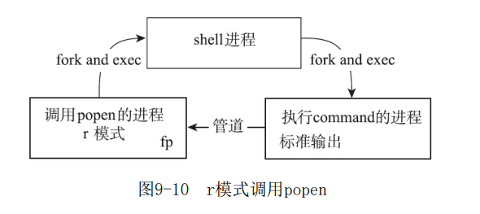
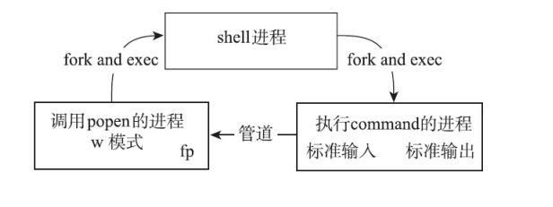

# 进程间通信 管道

管道的本质是内核维护了一块缓冲区与管道文件相关联，对管道的操作，被内核转换成对这块缓冲区的操作。


```c
#include <unistd.h>
int pipe(int pipefd[2]);
```

我们看一下父子进程中如何使用pipe

pipe[1]是写端，pipe[0]是读端。
如果强制写入读端，读写段，会报错。

下面这个例子就是父进程写，子进程读，并且双方约定好关闭不需要的一端。

```c
#include <unistd.h>
#include <stdio.h>

int main()
{
    int pipefd[2];
    pipe(pipefd);

    //pipefd[0] - read end
    //pipefd[1] - write end

    pid_t pid = fork();
    switch(pid) {
        case -1:
            return 1; // Fork failed
        case 0:{ // Child process{
            close(pipefd[1]);
            char buf[20];
            int n = read(pipefd[0], buf, sizeof(buf));
            buf[n] = '\0';
            printf("Child received: %s, cnt = %d\n", buf, n);
            close(pipefd[0]);
            return 0;
        }
        default: // Parent process pid > 0
            close(pipefd[0]);
            const char* msg = "Hello, pipe!";
            write(pipefd[1], msg, 12);
            waitpid(pid, NULL, 0); // Wait for child to finish
            close(pipefd[1]);
    }

    return 0;
}
```

## 关闭无用的管道写入端

读端调用read返回EOF的必要条件：
1. 所有相关的进程都已经关闭了管道的写入端fd
2. 管道中的所有数据都已经被读取完毕

所以如果无用的管道写入端没有正确关闭，若某一个进程调用read，就会一直阻塞。

如果正确关闭，读端就可以通过read的返回值来判断是否要关闭读端。


## 关闭无用的管道读入端

当管道的读取端不存在时，向写入端调用write时，内核会向write函数的调用进程发送一个SIGPIPE信号，并且这次调用会返回EPIPE。一般情况下，进程会忽略此信号，通过write的返回值就可以判断出所有的读取端都关闭了。

没有了消费者，生产者也没必要继续消费！

没有了观众，也就没有了表演。

```c
#include <unistd.h>
#include <stdio.h>
#include <signal.h>
#include <errno.h>
#include <string.h>
#include <stdlib.h>

void sighandler(int sig);
int main()
{
    int pipefd[2];
    pipe(pipefd);

    //pipefd[0] - read end
    //pipefd[1] - write end

    if(signal(SIGPIPE, sighandler) == SIG_ERR) {
        fprintf(stderr, "signal error (%s)\n", strerror(errno));
        exit(EXIT_FAILURE);
    }

    pid_t pid = fork();
    switch(pid) {
        case -1:
            return 1; // Fork failed
        case 0:{ // Child process{
            fprintf(stdout, "[CHILD] I will close the last read end of pipe\n");
            close(pipefd[0]);
            exit(EXIT_FAILURE);
        }
    }
    close(pipefd[0]);
    sleep(1); // Ensure child runs first

    int ret = 0;
    ret = write(pipefd[1], "Hello, pipe!", 12);
    if(ret == -1) {
        fprintf(stderr, "[PARENT] write error (%s)\n", strerror(errno));
    } else {
        fprintf(stdout, "[PARENT] write %d bytes to pipe\n", ret);
    }
    return 0;
}

void sighandler(int sig) {
    if(sig == SIGPIPE) {
        fprintf(stderr, "[PARENT] received SIGPIPE signal\n");
    }
}
```

## 管道大小

查看
```
cat /proc/sys/fs/pipe-max-size
1048576
```

修改
```
fcntl(fd, ?F_GETPIPE_Z);
ret = fcntl(fd, ?F_SETPIPE_SZ, size);
```

如果修改时管道中的内容大于fcntl函数调用中指定的size，此次调用会报错，返回EBUSY


## 与shell进行通信

linux封装了一个接口让我们很方便的与shell交互-popen

```c
#include <stdio.h>
FILE *popen(const char* command, const char *type);
int pclose(FILE *stream);
```

popen会创建一个管道，并且fork一个子进程来执行shell，shell会创建一个子进程来执行command。

type = r

command的标准输出就会写入管道，从而被调用popen的进程读到-通过对popen的返回值执行read/fgets操作读取



type = w

通过对popen返回值执行write/fputs操作，往管道中写入，写入的内容传给执行command的进程

